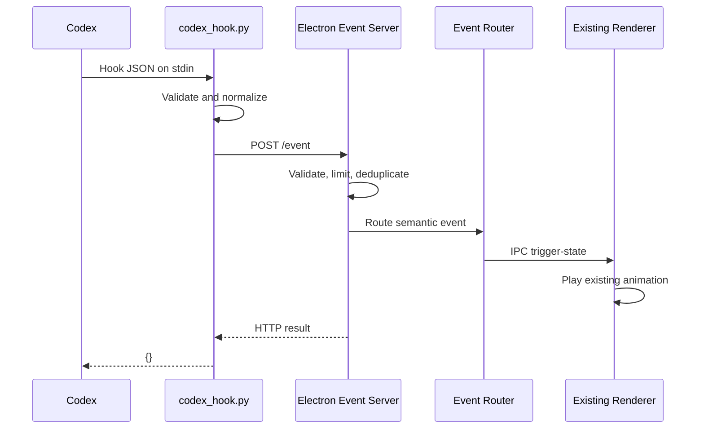

# WorkBuddy v1.1.0 Codex Hooks Design

- **Status:** Approved for implementation planning
- **Approved:** 2026-07-31
- **Target platform:** Apple Silicon Mac, initially verified on macOS 26.5.2
- **Baseline:** WorkBuddy v1.0.0 CodeBuddy integration

## 1. Product Context

WorkBuddy is an environment-aware desktop companion for people who use coding agents. It turns otherwise invisible agent activity into low-interruption visual feedback.

The product is positioned as:

- 70% user-facing AI product: status legibility, reduced attention switching, companionship, and eventually healthy-work reminders.
- 30% technical product: lifecycle events, event normalization, reliability, privacy, graceful degradation, and future agent observability.

WorkBuddy does not answer coding questions or replace Codex. It is the status-expression and companionship layer between Codex and the user.

## 2. v1.1.0 Objective

Replace the CodeBuddy-specific Hook integration with Codex Hooks while reusing the existing Electron window, state machine, animations, local HTTP transport, sleep behavior, eye tracking, and completion sound.

The version validates one complete vertical slice:

```text
Codex lifecycle event
→ Python Hook adapter
→ local HTTP event
→ Electron event router
→ existing pet animation
```

The success of v1.1.0 is determined by the reliability and safety of this event path, not by animation variety.

## 3. Goals

- Observe the core Codex lifecycle without changing Codex behavior.
- Normalize Codex-specific payloads into a stable WorkBuddy event protocol.
- Map normalized events to the existing six visual states.
- Keep the Hook non-blocking when WorkBuddy is closed or unavailable.
- Avoid transmitting or storing prompts, code, commands, file paths, transcripts, and tool output.
- Add automated contract and routing tests.
- Produce an Apple Silicon macOS build and a repeatable acceptance report.

## 4. Non-Goals

v1.1.0 will not add:

- New animation assets.
- Apple Music awareness or headphones.
- Water and break reminders.
- Chat, RAG, LLM-generated dialogue, or long-term memory.
- Direct Codex controls such as pause, retry, approve, or deny.
- Error-specific animation or success/failure classification for tool output.
- Subagent-specific behavior.
- Intel Mac, Windows, Linux, signing, notarization, auto-update, or Mac App Store distribution.

## 5. Chosen Architecture

The existing Electron product remains the application shell. A short-lived Python adapter is launched by Codex for each configured Hook event.

Python is deliberately not a persistent backend in v1.1.0. It uses the Python standard library, sends one loopback HTTP request, writes the neutral Hook result `{}` to stdout, and exits.

### 5.1 Proposed File Structure

```text
workbuddy-pet/
├── main.js
├── preload.js
├── package.json
├── hooks/
│   ├── codex_hook.py
│   └── codex-hooks.example.json
├── src/
│   ├── main/
│   │   ├── event-server.js
│   │   └── event-router.js
│   └── renderer/
│       ├── index.html
│       ├── renderer.js
│       └── style.css
├── tests/
│   ├── fixtures/
│   │   └── codex/
│   ├── python/
│   │   └── test_codex_hook.py
│   └── js/
│       └── event-router.test.js
├── assets/
├── docs/
│   ├── iterations/
│   └── superpowers/specs/
└── README.md
```

### 5.2 Component Responsibilities

#### `hooks/codex_hook.py`

- Read one Codex Hook JSON object from stdin.
- Validate only the fields needed for event normalization.
- Ignore unsupported events and excluded event variants.
- Remove sensitive and unnecessary fields.
- Create a WorkBuddy event.
- POST the event to `127.0.0.1:18920/event` with a 200 ms timeout and no retry.
- Write exactly `{}` to stdout and exit with code `0`, including failure cases.

It must never block or rewrite a tool call, approve or deny a permission request, request a continuation, or inject context into Codex.

#### `src/main/event-server.js`

- Listen only on `127.0.0.1:18920`.
- Accept `POST /event`.
- Retain `POST /state` for manual animation testing and backward compatibility.
- Reject unsupported methods and routes.
- Enforce a 16 KB body limit.
- Validate the event envelope.
- Suppress duplicate events for two seconds.
- Send accepted events to `event-router.js`.
- Avoid permissive CORS headers because browser-originated calls are not required.
- Log a clear diagnostic if the port is occupied without crashing the pet window.

#### `src/main/event-router.js`

- Validate the supported semantic event type.
- Map each event to an existing visual state.
- Return a pure routing result that can be unit tested without Electron.
- Send the mapped state to the existing renderer IPC path.

#### Existing renderer

- Continue to own animation playback, timeouts, wake-up, sleep, sound, eye tracking, blinking, and random reading.
- Receive only the mapped visual state in v1.1.0.
- Avoid broad refactoring until the Codex event path is verified.

## 6. WorkBuddy Event Protocol

### 6.1 Envelope

```json
{
  "schema_version": "1.0",
  "event_id": "evt_a82f4c3d",
  "source": "codex",
  "event_type": "tool.started",
  "occurred_at": "2026-07-31T08:30:00.000Z",
  "session_id": "thr_123",
  "turn_id": "turn_456",
  "tool_use_id": "call_789",
  "metadata": {
    "tool_name": "Bash"
  }
}
```

### 6.2 Field Contract

| Field | Required | Contract |
|---|---:|---|
| `schema_version` | Yes | Fixed to `"1.0"` for this protocol |
| `event_id` | Yes | Stable fingerprint used for short-window deduplication |
| `source` | Yes | Fixed to `"codex"` |
| `event_type` | Yes | One of the supported semantic events |
| `occurred_at` | Yes | UTC ISO 8601 timestamp |
| `session_id` | Yes | Current Codex session identifier |
| `turn_id` | No | Current turn identifier when available |
| `tool_use_id` | No | Tool invocation identifier when available |
| `metadata` | Yes | Allowlisted, non-sensitive display metadata |

The adapter derives `event_id` from a SHA-256 fingerprint of the session ID, turn ID, Hook event name, tool-use ID, and applicable session-start source. The server suppresses an identical event ID only within a two-second window, allowing legitimate later lifecycle events.

`schema_version` changes only for a breaking protocol change. Product versions and animation changes do not alter the schema version.

### 6.3 Supported Semantic Events

```text
session.started
turn.prompt_submitted
tool.started
tool.finished
permission.requested
turn.finished
session.ended
```

### 6.4 Privacy Boundary

The WorkBuddy event must not contain:

- `prompt`
- `tool_input`
- `tool_response`
- `transcript_path`
- `last_assistant_message`
- command text
- file paths
- file contents
- environment variables
- credentials or API keys

The allowlisted metadata for v1.1.0 is:

- `session_source` for `session.started`
- `tool_name` for tool and permission events

WorkBuddy does not persist canonical events in v1.1.0.

## 7. Hook Normalization and Visual Mapping

| Codex Hook | Condition | Semantic event | Existing visual state |
|---|---|---|---|
| `SessionStart` | `startup`, `resume`, or `clear` | `session.started` | `idle` |
| `UserPromptSubmit` | Any | `turn.prompt_submitted` | `thinking` |
| `PreToolUse` | Any supported local tool | `tool.started` | `working` |
| `PostToolUse` | Any supported local tool result | `tool.finished` | `working` |
| `PermissionRequest` | Approval is required | `permission.requested` | `attention` |
| `Stop` | `stop_hook_active` is `false` | `turn.finished` | `happy` |
| `Stop` | `stop_hook_active` is `true` | Ignored | No change |
| `SessionEnd` | Main session ends | `session.ended` | `sleeping` |

`SessionStart` with `source: compact` is excluded so mid-turn compaction does not force the pet back to idle.

The following hooks are intentionally not configured in v1.1.0:

- `PreCompact`
- `PostCompact`
- `SubagentStart`
- `SubagentStop`

Random reading, mouse tracking, blinking, and 60-second inactivity sleep remain pet-owned behavior and do not require Codex events.

## 8. State Behavior

- `thinking` plays the existing `think.gif` for 5–10 seconds unless interrupted by work.
- `working` plays `work.gif`; each tool event refreshes the 30-second fallback timeout.
- `attention` reuses `think.gif` with the existing pulse class for five seconds.
- `happy` plays `happy.gif` and the completion sound once, then returns to idle after three seconds.
- `sleeping` plays `pet-sleeping.gif` until mouse movement or a new active event wakes the pet.
- `happy` remains the highest-priority state.
- `permission.requested` can interrupt `working`.
- `working` can interrupt `thinking`.

Reusing an animation does not merge event semantics. For example, `permission.requested` remains distinct from `turn.prompt_submitted` even though both temporarily use the thinking asset.

## 9. Data Flow



## 10. HTTP Contract

### `POST /event`

Accepts the event envelope above.

Accepted response:

```json
{
  "status": "ok",
  "event_id": "evt_a82f4c3d",
  "state": "working"
}
```

Duplicate response:

```json
{
  "status": "ignored",
  "reason": "duplicate_event"
}
```

Status behavior:

- `200`: accepted or duplicate ignored
- `400`: invalid JSON, envelope, version, source, or event type
- `404`: unknown route
- `405`: unsupported method
- `413`: body exceeds 16 KB

### `POST /state`

Retained for manual state testing and backward compatibility. The Codex adapter uses `/event`, not `/state`.

## 11. Error Handling and Degradation

| Condition | Required behavior |
|---|---|
| WorkBuddy is closed | Python exits normally; Codex is unaffected |
| Loopback request times out | No retry; Python exits normally |
| Hook input is malformed | No event is sent; Python exits normally |
| Event is unknown | Server rejects it; renderer state does not change |
| Event is duplicated | Server ignores the duplicate within two seconds |
| Renderer is not ready | Server does not crash; the event may be dropped |
| Port 18920 is occupied | Pet window remains available and logs a diagnostic |
| Tool output represents failure | Remain `working`; error classification is deferred |

The Hook integration is observational only. Failure of WorkBuddy must never become failure of Codex.

## 12. Test Strategy

### 12.1 Python Contract Tests

Use the standard-library `unittest` runner.

Required cases:

- Each supported Codex Hook maps to the expected semantic event.
- `SessionStart/compact` is ignored.
- `Stop` with `stop_hook_active: true` is ignored.
- Malformed JSON and unknown Hook events exit normally without a request.
- The canonical payload excludes every forbidden privacy field.
- stdout is exactly `{}` and the exit code is `0`.

### 12.2 JavaScript Router Tests

Use Node's built-in `node:test`.

Required cases:

- Each semantic event maps to the expected visual state.
- Unknown events, bad schema versions, missing fields, and oversized bodies are rejected.
- Duplicate events are processed once.
- Routing code is testable without starting an Electron window.

### 12.3 Integration Test

Start a test HTTP server, run `codex_hook.py` with fixture JSON on stdin, capture the emitted request, and assert:

- correct protocol envelope
- loopback-only destination
- no sensitive fields
- stdout `{}` and exit code `0`

### 12.4 End-to-End Product Tests

| Scenario | Expected visible result |
|---|---|
| Start a Codex session | Idle |
| Submit a task | Thinking within 500 ms |
| Run a safe local tool | Working without idle flicker |
| Request permission or use its fixture | Attention without changing approval behavior |
| Finish a small read-only task | Happy and one sound, then idle |
| Send a session-end fixture | Sleeping; a new active event wakes the pet |

### 12.5 Degradation Tests

- Run Hook fixtures with WorkBuddy closed.
- Stop the event server during a Hook call.
- Send malformed and oversized JSON.
- Send rapid state sequences.
- Send duplicate completion events.
- Occupy port 18920 before launching WorkBuddy.

## 13. Acceptance Gates

v1.1.0 is complete only when:

- Python contract tests pass.
- JavaScript router tests pass.
- Hook-to-HTTP integration tests pass.
- The six Hook-targeted visual states remain functional; the pet-owned Reading behavior also remains unchanged.
- Real Codex Thinking, Working, and Happy paths pass.
- Permission behavior passes with a fixture and, when safely available, a real approval.
- WorkBuddy being closed does not surface a Codex error.
- Event-to-visible-state latency is at most 500 ms across at least 20 trials.
- Hook exit time while WorkBuddy is unavailable is at most 500 ms.
- No private payload field reaches WorkBuddy events.
- No Hook blocks, rewrites, approves, denies, or continues Codex.
- The arm64 macOS build succeeds and runs after installation.
- README and iteration documentation are updated with actual evidence.

## 14. Documentation Structure

Long-term product documentation uses:

```text
docs/
├── product/
│   ├── overview.md
│   ├── architecture.md
│   └── metrics.md
└── iterations/
    ├── README.md
    ├── v1.0.0-codebuddy-baseline.md
    ├── v1.1.0-codex-hooks.md
    └── one document per later iteration
```

The iteration index remains short. Each active version owns its problem, hypothesis, scope, decisions, changes, validation, evidence, feedback, retrospective, and next decision.

Product-wide documents will be created only when their content is stable enough to avoid duplicating version-specific records.

## 15. Future Evolution

After v1.1.0 passes:

1. v1.2.0 adds distinct permission and error visuals.
2. v1.3.0 adds Apple Music awareness and a headphones overlay.
3. v1.4.0 adds deterministic water and break reminders.
4. v1.5.0 adds settings, local preferences, and the first five-user test.

Later behavior can change without rewriting the Codex adapter because semantic events remain independent from visual states.
